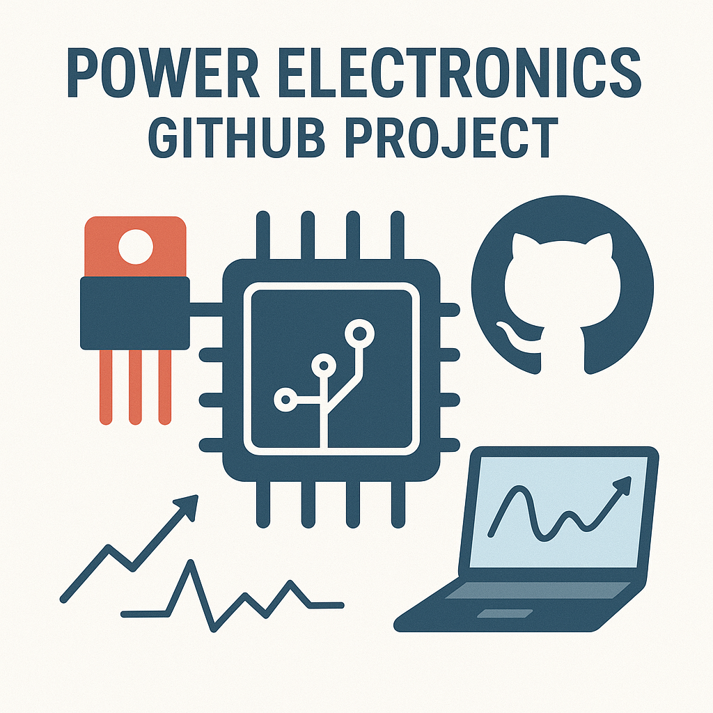

# Welcome to the IEEE PELS GitHub Initiative

Get a short overview, who we are:
 * [IEEE Power Electronics Society (PELS)](https://www.ieee-pels.org/)
 * [IEEE Transactions on Power Electronics (TPEL)](https://www.ieee-pels.org/publications/transactions-on-power-electronics/)
 * [Journal of Emerging and Selected Topics in Power Electronics (JESTPE)](https://www.ieee-pels.org/publications/journal-of-emerging-and-selected-topics-in-power-electronics/)
 * [IEEE Open Journal of Power Electronics (OJPE)](https://www.ieee-pels.org/publications/open-journal-of-power-electronics/)
 * [IEEE Transactions on Transportation Electrification (TTE)](https://www.ieee-pels.org/publications/transactions-on-transportation-electrification/)

Our mission: 
 * Create a unified platform for sharing data, models, and tools in power electronics
 * Promote open-source culture in power electronics research and education
 * Train the next generation power electronics + AI + software engineers

This repository lists databases, publications and software in the field of power electronics
 * [awesome-PELS-open-source-projects](https://github.com/IEEE-PELS/awesome-open-source-power-electronics)
 * [awesome-PELS-open-source-ai-tools](https://github.com/IEEE-PELS/awesome-PELS-open-source-ai-tools)
 * [awesome-PELS-open-source-publications](https://github.com/IEEE-PELS/awesome-PELS-open-source-publications)
 * [awesome-PELS-open-source-editors-pick](https://github.com/IEEE-PELS/awesome-PELS-open-source-editors-pick)

Feel free to open a pull request to contribute your publication / software to the lists. Consider the [community guidelines](https://github.com/IEEE-PELS/community-guidelines) before opening the pull request.

# Contact

For general questions or suggestions:
- **pelsgithub@gmail.com**
- Join discussions via GitHub in any repository
